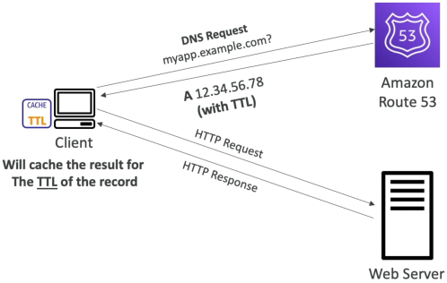

# TTL

A DNS **Time-to-Live (TTL)** is a mandatory integer flag (measured in seconds) attached to a DNS record that tells intermediate recursive resolvers and client devices exactly how long they are allowed to store that records's answer in local memory. During this window, the client will completely bypass Route 53, pulling the cached IP instantly from its own local state.

## Key Takeaways

### The Architectural Trade-Off Matrix

When setting up your record sets, you have to balance speed against adaptability. For standard non-alias records, choosing your TTL properties shifts your infrastructure profiles:

| Configuration Metric   | High TTL (e.g., 24 Hours / 86400s)                                                          | Low TTL (e.g., 60 Seconds)                                                            |
| ---------------------- | ------------------------------------------------------------------------------------------- | ------------------------------------------------------------------------------------- |
| AWS Invoice Cost       | 📉 Ultra-Low. Resolvers cache your records all day, blocking queries from hitting Route 53. | 📈 Higher. Clients constantly ping Route 53, inflating your standard query bill.      |
| Propagation Velocity   | Very Slow. Changing a record takes up to a full day to reflect globally on the web.         | Blazing Fast. Record modifications update across the internet in under a minute.      |
| Data Freshness         | High risk of clients pulling stale/outdated data if a backend server fails.                 | Excellent. Resolvers drop records quickly, maintaining a tight source-of-truth link.  |
| Best Practice Use Case | Stable, unchanging entries like primary root domains or MX mail server records.             | Highly volatile stacks, canary test deployments, and active disaster-recovery routes. |

### The Live "Pre-Migration" Lowering Strategy

If your application is currently running on a High TTL profile (like 24 hours) and you need to execute an upcoming server migration or database cutover, senior engineers execute this strict deployment loop to prevent massive downtime:

```
[24-Hour High TTL State] ──> Step 1: Lower TTL to 60s ──> Step 2: Wait exactly 24 Hours
                                                                    │
[Reset TTL back to High] <── Step 4: Cutover to New Server IP <─────┘
```

### Reading the `dig` caching countdown

When you use `dig` utility tool inside AWS CloudShell to inspect `demo.app.com` the output elegantly exposed how caching handles timers:

```
;; ANSWER SECTION:
demo.app.com.   115   IN   A   54.x.x.x
```

- **The Countdown Mechanism**: The number `115` isn't a static parameter written in Route 53. Because CloudShell is hitting a caching recursive resolver, it shows the **remaining active lifespan** of that memory block before it gets violently evicted.
- Running the `dig` command 17 seconds later returns `98`. The moment that value strikes `0`, the resolver flushes the data, forces a clean upstream trip back to Route 53 to claim a fresh copy, and resets the local clock right back up to your configured `120` base target.



## Exam Tips

**The Alias Exception Constraint**: The exam loves to test this rule: **The standard TTL field is mandatory for every single DNS record type you create in Route 53, EXCEPT for Alias Records**. When you select the _Alias_: Yes toggle to map a domain directly to an AWS ALB or CloudFront distribution, the TTL parameter disappears entirely from the console wizard screen. This is because **Route 53 automatically manages and inherits the internal TTL properties directly from the underlying AWS resource**, meaning it responds dynamically to backend scaling updates without needing configuration from your code!.
