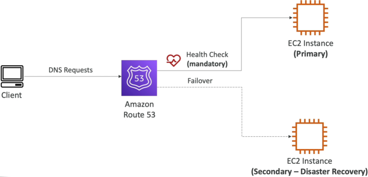
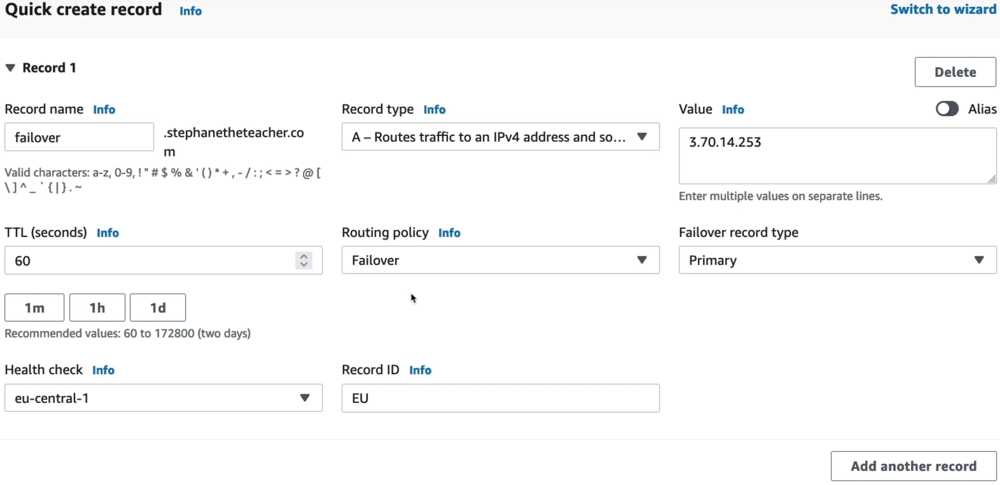

# Routing Policy: Failover

The **Failover Routing Policy** is designed strictly for Active-Passive high-availability (HA) deployments. It lets you configure exactly two records sharing the sae name: one designated as the **Primary (Active)** target and the other as the **Secondary (Passive/Disaster Recovery)** target. Route 53 couples the Primary record to an active health check. As long as that check returns green, 100% of global queries resolve to the Primary infrastructure. The exact second the check fails, Route 53 drops the primary path and shifts 100% of the users to the Secondary destination.



## Key Takeaways

### The Failover Lifecycle

Stephane's lab setup beautifully mimics how a real-world multi-region disaster recovery pipeline fires:

```
[ Active State: Health Check Green ]
Client Browser ───> [ Route 53 (failover.domain.com) ] ───> Returns: EU-Central Master (Active)
                                   │
                    (Primary Security Group Drops Port 80)
                                   ▼
[ Failover State: Health Check Tripped Unhealthy ]
Client Browser ───> [ Route 53 (failover.domain.com) ] ───> Returns: US-East DR Node (Standby)
```

1. **The Target Configuration**:
   - **Primary Record**: Pointed to the Frankfurt EC2 instance (`eu-central-1`) → Coupled tightly to the `eu-central-1` health check.
   - **Secondary Record**: Pointed to the N.Virginia instance (`us-east-1`) → Standby node.
2. **The Chaos Event**: Just like in the previous module, removing the HTTP inbound rule from Frankfurt's SG causes a `Connection Timeout`.
3. **The DNS Cutover**: Once the health checkers log enough consecutive timeout to breach the failure threshold, Route 53 alters its mapping matrix. The next time the client browser queries the domain (after the 60-second record TTL clears), Route 53 silently servers the N.Virginia IP instead.
4. **The Automatic Fallback**: When you restore the port 80 rule, the health checkers instantly verify the web server is processing payloads again. Route 53 flips the mapping back to the primary Frankfurt node, returning your cluster to its baseline configuration.



### Critical Guardrails to Remember

- **The Primary Health Check Mandate**: Attaching an active Route 53 Health Check to your **Primary** record is absolutely mandatory. If you don't attach one, Route 53 has no way to sense that your active stack has crashed, completely blinding your failover mechanics.
- **The Secondary Health Check Option**: Attaching a check to the **Secondary** record is optional. If you omit it, Route 53 assumes your DR environment is always healthy . If you _do_ attach one, and both your Primary and Secondary nodes fail simultaneously, Route 53 will default back to the Primary record anyway.
- **Strict 1-to-1 Topology Limits**: You can only assign exactly _one_ Primary record and _one_ Secondary record per distinct subdomain text block inside this policy type. If you need to map complex multi-node failover loops, you must use the Route 53 **Traffic Flow** nested policies.

## Exam Tips

The developer exam expects you to identify when Active-Passive is the definitive answer versus an Active-Active deployment:

**The Cost-Optimized Idle Warm Standby**: If an exam question says, _"You are architecting a DR strategy for a critical internal web tool. Compliance mandates a cross-region backup environment, but management explicitly demands minimizing run-rate infrastructure costs during normal operations. They are completely fine with a 1 to 2 minute recovery window (RTO) during an actual disaster"_, look for the Active-Passive pattern. **The textbook answer is to deploy a Failover Routing Policy. Map your Primary record to your active ALB. Map your secondary record to an identical ASG in a backup region, but keep its Desired and Minimum capacity parameters set to exactly 0 instances.** When a failover hits, Route 53 moves the traffic over, and an automation pipeline instantly scales the backup EC2 pool up from zero to begin processing workloads.
