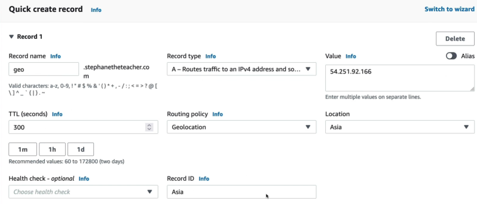

# Routing Policy: Geolocation

**Geolocation Routing** is where you stop guessing based on internet speeds and start enforcing exact geographic boundaries at the DNS plane. **Latency Routing is non-deterministic (dynamic)**, but **Geolocation routing is 100% deterministic (fixed)**.

The **Route 53 Geolocation Routing Policy** allows engineers to route traffic based strictly on the continent, country, or even specific US state from which a DNS query originates. Instead of optimizing for pure network packet speeds, Geolocation routing is built for application localisation, international licensing compliance, legal data residency enforcement, and localised content delivery.



## Key Takeaways

### The Granularity Match Hierarchy

When a DNS query strikes Route 53, the engine scans the GeoIP tracking files and evaluates your configured records from **most specific to least specific**. It executes this exact priority loop:

1. **Specific US State**: (e.g., California, Texas, New York) → Highest specificity
2. **Country**: (e.g., Netherlands or Australia)
3. **Continent**: (e.g., Asia or Europe)
4. **The Default Record** (`*`): The global fallback boundary catcher → Lowest specificity

**The Specificity Overlap Rule**: If a user connects to your application from Los Angeles, they technically match three distinct records in Stephane's example dashboard: The United States country rile, the North America contintent rule, and the universal Default rule.
**Route 53 will always serve them the most granular match available**, meaning they get mapped straight to the specific US country record first, completely bypassing the wider continent or default fallbacks.

### Analyzing Stephane's Chaos & Firewall Re-run

Stephane ran into a classic production troubleshooting block during his live VPN execution loops. Let's map exactly how the routing paths parsed out across the globe:

```
[ Active VPN Node Location ] ───> [ Route 53 Geolocation Match ] ───> [ System Outcome / Target Node ]
 ├─── Sitting in Europe         ───> No rule match ──> Hits Default ───> 3.70.x.x (Frankfurt Engine)
 ├─── Dialing VPN to India      ───> Matches "Asia" Continent Rule  ───> 13.x.x.x (Singapore Engine)
 │                                                                          └── ⚠️ Initial Port 80 SG Drop = Timeout
 ├─── Dialing VPN to US         ───> Matches "United States" Rule   ───> 54.x.x.x (N. Virginia Engine)
 └─── Dialing VPN to Mexico     ───> No rule match ──> Hits Default ───> 3.70.x.x (Frankfurt Engine)
```

- **The Security Group Catch**: When Stephane jumped his network node over to India via VPN, the site threw a frustrating hang and eventual `Connection Timeout`. Because he forgot to restore the Port 80 SG rules from his previous Failover lab, the packet hit a firewall wall, **Remember: Geolocation routing successfully mapped the user to the closest server text string, but it cannot override an underlying server-side network block!**.
- **The Mexico Default Fallback**: When he dialled his coordinates to Mexico, the request didn't match the custom United States rule or the Asia continent block. since Route 53 matches nothing else, it safely dropped the user down onto the **Default Record**, which directed them right back to Europe (`eu-central-1`).

:::warning
**Always Create a Default Record**: If you configure Geolocation routing but omit a Default record, Route 53 will return a "No Answer" code to any user querying from an unmapped country. To the end-user, your entire website will completely dead.
:::

## Exam Tips

**The Data Sovereignty Pattern**: If an exam question states, _"You are building a global financial tech platform on AWS, European data protection laws (GDPR) strictly mandate that any financial records or user sessions orignating from the EU must be stored and processed inside European borders. Performance optimization is a secondary priority to strict legal compliance"_, look for the Geolocation play. **The definitive cloud answer is to implement Geolocation Routing. Map your European continent record sets directly to your highly available database tier inside Frankfurt (`eu-central-1`) or Ireland (`eu-west-1`), ensuring no EU data blocks ever leak into US or Asian computational loops.**
