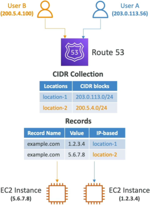

# Routing Policy: IP-Based

The **IP-Based Routing Policy** allows engineers to route traffic to specific infrastructure endpoints based explicitly on the client's originating IPv4 or IPv6 address. Instead of letting AWS calculate performance telemetry dynamically (like latency routing) or ap users to maps like (Geolocation routing), you define strict **Classless Inter-Domain Routing (CIDR) blocks**. When a query strikes Route 53, it matches the caller's IP against your defined blocks and servers the exact record you specified.

## Key Takeaways

### The 2-Step Configuration Workflow

You cannot just type an IP range directly into a Route 53 record slot when using this policy. AWS forces you to separate the _definition of the network_ from the _DNS record itself_:

- **Step 1: Create a CIDR Collection**: You build a reusable global group named something like `Corporate-Offices` or `Partner-ISP-Tracks`. Inside that collection, you define named locations (e.g., `Location-A`, `Location-B`) and assign them explicit CIDR block arrays (like `203.0.113.0/24`).
- **Step 2: Build the Record Sets**: You create a set of records sharing the identical name and type (e.g., `app.mybrand.com`). You select **IP-based** as the routing policy, link it to your custom CIDR collection, select the target Location descriptor, and input the corresponding server IP address.

### Routing Flow



```
[ User Query Phase ] ───> [ Route 53 CIDR Collection Scan ] ───> [ Returned DNS Answer ]
 ├─── User A: 203.0.x.x  ───> Matches "Location 1" Block   ───> Returns 1.2.3.4 (EC2 Tier A)
 ├─── User B: 200.5.x.x  ───> Matches "Location 2" Block   ───> Returns 5.6.7.8 (EC2 Tier B)
 └─── User C: 8.8.x.x    ───> No match inside collection   ───> ⚠️ DROPPED / NXDOMAIN (Unless Default exists)
```

### Elite Production Use Cases

- 📉 **Slashing Network Egress Surcharges**: If you operate a hybrid cloud architecture and know your on-premises servers or core business partner always dial in from a fixed corporate IP subnet, you can use IP-based routing to bypass public transit pipelines. Force their DNS queries to resolve straight to your **VPC Direct Connect or AWS Global Accelerator** endpoints, slicing down your cross-region data transfer bills.
- ⚡ **End-User Performance Optimization**: If you manage a SaaS platform and discover that a massive cluster or users on a specific ISP is bottlenecking, you can hardcode their known ISP CIDR blocks to point directly to a dedicated, over-provisioned cluster pool to maintain an elite user experience.

## Exam Tips

The exam loves to see if you can pick the right policy when dealing with client-side IP data.

**The Static Range Compliance Blueprint**: If an exam scenario states, _"Your legal team has negotiated a private data-transit agreement with a specific enterprise vendor. The vendor operates exclusively out of the static IP subnet `198.51.100.0/22`. You need to ensure that any traffic from this vendor hitting your API subdomain is directed to a premium, isolated ALB tier, while keeping configuration overhead minimal"_, **the definitive answer is IP-based routing**. Geolocation is too broad (it targets entire countries), and latency is too unpredictable. Only IP-based routing lets you target a raw, explicit CIDR footprint seamlessly.
