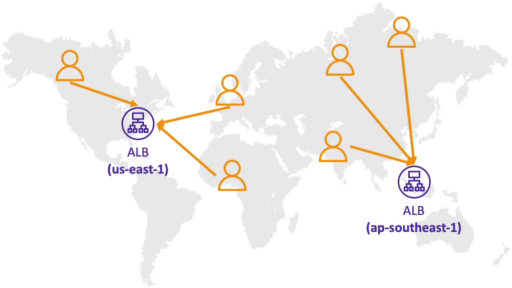
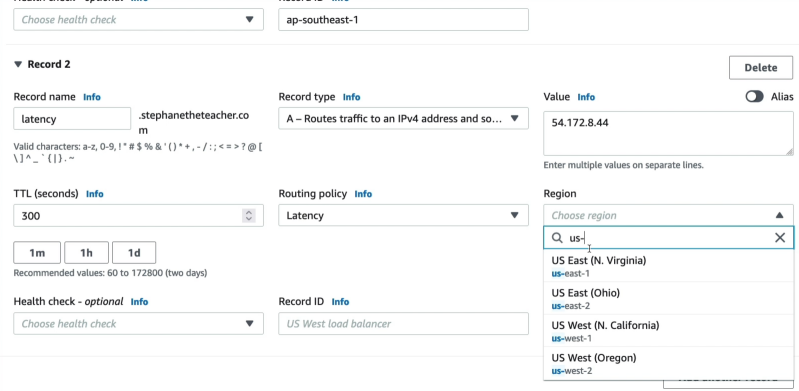

# Routing Policy: Latency

When you scale your application to global footprint, you don't want a developer or user sitting in Sydney to suffer through 300ms round-trip lag spike because their browser is fetching data from a server physically located in North Virginia. Latency-based routing completely solves this by transforming your DNS layer into a performance radar.

The **Latency-Based Routing Policy** directs incoming user traffic to the specific AWS region that offers the absolute lowest network latency (fastest round-trip response time) for that specific client. Rather than relying on rigid geographic distance, Route 53 continuously tracks internet-to-AWS telemetry in a massive global network latency database, ensuring that users automatically hit the absolute highest-performing server stack available.



## Key Takeaways

### How It Actually Works

Stephane's verification using a VPN exposes a critical architectural reality of how AWS calculates these network paths:

- **The AWS Latency Database**: AWS constantly measures network performance from all corners of the public internet back into every active AWS data center region.
- **The Resolver Proxy Rule**: route 53 does not measure the latency directly to the end-user's laptop screen. Instead,**it measures the network latency to the client's Recursive DNS Resolver** (such as their ISP's local name server, or a public utility like Google's `8.8.8.8`).
- **The EDNS Extension Save (`ECS`)**: To prevent routing errors if a user in Jakarta uses a public DNS resolver located in the Europe, Route 53 natively supports **EDNS0 Client Subnet (ECS)**. This feature allows the resolver to pass a truncated, safe snippet of the user's _actual_ home IP address down to Route 53, forcing an accurate local latency lookup anyway.

### Analysing Stephane's Lie Testing Lab

When Stephane jumped to different VPN locations, the DNS profile change dynamically:

```
[ Client Network Node Location ] ───> [ Route 53 Telemetry Matrix ] ───> [ Returned Target IP Endpoint ]
 ├─── Sitting in Frankfurt       ───> Lowest Latency: eu-central-1 ───> 3.70.x.x (Frankfurt EC2)
 ├─── Dialing VPN to Canada     ───> Lowest Latency: us-east-1    ───> 54.x.x.x (N. Virginia EC2)
 └─── Dialing VPN to Hong Kong   ───> Lowest Latency: ap-southeast-1 ──> 13.x.x.x (Singapore EC2)
```



### Performance vs Compliance: Latency vs GeoLocation

Developers often confuse Latency Routing with **Geolocation Routing**. Here is the definitive split you need to lock down for production builds and the exam:

- **Latency Routing (Performance First)**: Entirely non-deterministic. It focuses _strictly_ on network speed. If a transatlantic fiber cable breaks, a user sitting in Ireland might temporarily experience faster network routing to a server in New York (`us-east-1`) than a server in Germany (`eu-central-1`). Route 53 will shift them to the US instantly to preserve speed.
- **Geolocation Routing (Compliance First)**: 100% deterministic based strictly on borders and maps. If you state that European users must hit your German data center (due to strict GDPR compliance or regional language localization), **Route 53 will route them to Germany every single time, even if the network latency to that region is currently lagging**.

## Exam Tips

- **The Silent Blackhole Disaster**: If you configure Latency-Based records for your global application across multiple regions, but **fail to attach a Route 53 Health Check** to each record row, you are exposed to a major failure. If your Singapore data center completely crashes, Route 53's latency database doesn't care, it still sees Singapore as the lowest network latency hop for Asian users. It will continue to server that dead IP to your users, completely blinding them. **The best practice is to always couple Latency Routing with active Health Checks. The moment an endpoint fails, Route 53 instantly removes that region from the latency calculation and gracefully redirect impacted user to their next-best, healthy region.**
