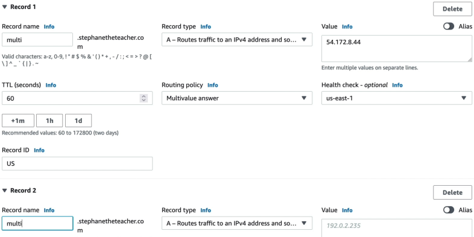
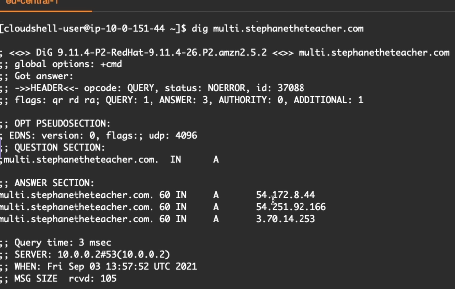
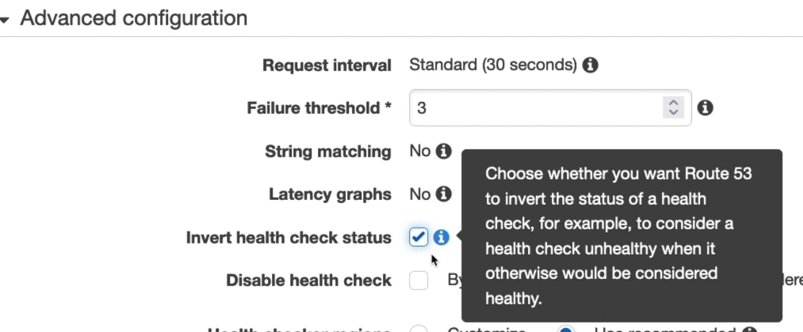
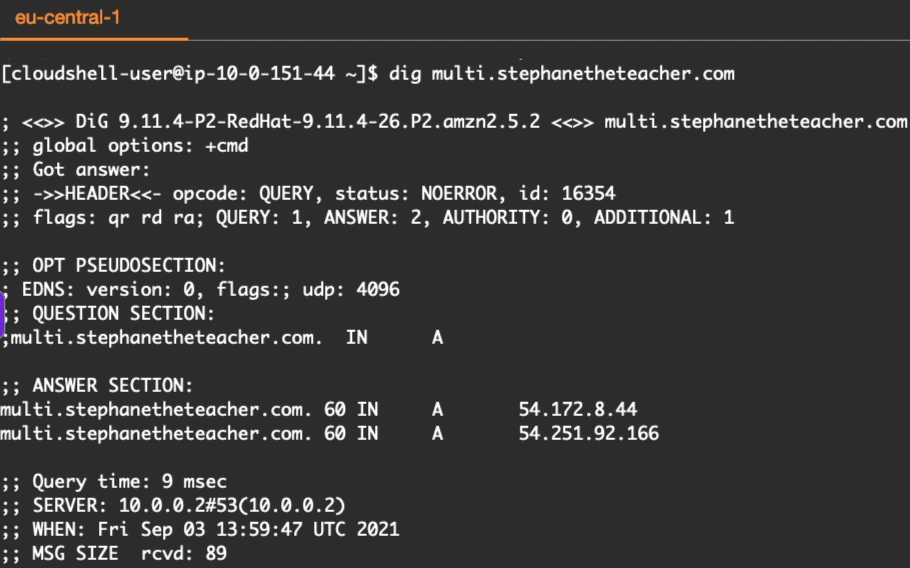

# Routing Policy: Multi Value

**The Multi Value Routing Policy** is essentially **Simple Routing on Steroids**, the biggest takeaway here is the integration of **Health Checks**. While a multi-value Simple record blindly throws a list of IPs at a client (even if half of them are dead), Multi-Value answer routing acts like an intelligent safety net.

When a client queries the domain, Route 53 evaluates the health of all nodes on the fly and returns a randomized subset of up to **eight strictly healthy records**. This delivers native, client-side round-robin load balancing without the cost of a physical load balancer.

## Key Takeaways

### The Multi-Value Resolution Mechanic

#### 🟢 The All-Healthy Baseline State

When you run dig `multi.example.com` while all your regional instances (Singapore, Sydney, Frankfurt) are healthy, Route 53 packages all three distinct IP answers into the **Answer Section** of a single DNS response payload. The client's operating system handles the choice from there.

#### 🔴 The "Inverted" Failure State

When Stephane checks the **"Inverted Health Status"** box on the Frankfurt (`eu-central-1`) health check, he tells AWS: _"Treat a running server as dead"_. The exact second route 53 registers this state shift, it alters its DNS response. The next time you fire a `dig` command, the Frankfurt IP disappears from the payload, leaving only the surviving N. Virginia and Singapore addresses. The client never even learn the dead IP existed, preventing a browser connection timeout.

### ⚖️ Simple vs. Multi-Value vs. ELB

| Architectural Metric       | Simple Routing (Multi-IP list)                                     | Multi-Value Answer Routing                                              | Elastic Load Balancer (ALB/NLB)                                               |
| -------------------------- | ------------------------------------------------------------------ | ----------------------------------------------------------------------- | ----------------------------------------------------------------------------- |
| **Record Sizing Matrix**   | One single record containing a flat list of multiple IP addresses. | Multiple separate records sharing the same name and a unique Record ID. | A single record pointing straight to a scalable proxy array.                  |
| **Active Health Checking** | ❌ Completely Unsupported. Blindly serves dead targets.            | ✅ Fully Supported. Drops unhealthy records instantly.                  | ✅ Fully Supported at the protocol layer.                                     |
| **Maximum Return Count**   | Returns all hardcoded values in the record container.              | Returns up to 8 healthy records at random per query request.            | Returns the target proxy IP mapping layer.                                    |
| **Alias Target Support**   | Yes.                                                               | ❌ No. Standard A or AAAA IP addresses only.                            | Yes (Native integration).                                                     |
| **Load Balancing Type**    | "Primitive, client-side round-robin."                              | Client-side round-robin up to 8 targets.                                | True server-side load balancing with sticky sessions and connection draining. |

:::info
**Not an ELB Substitute**: If you have 50 healthy servers mapped under a multi-value setup, Route 53 will randomly select 8 of them to return to a user. If that user's browser grabs the list, it connects to one IP. If that specific machine gets overwhelmed with heavy traffic, DNS cannot save you. A real Load Balancer (ELB) acts a physical middleman that measures actual traffic concurrency and routes packets intelligently - DNS just hands out a list of options.
:::

## Exam Tips

**The Multi-Value Sizing Limit**: Pay close attention to the data constraint. If an exam scenario says, _"You have configured a Multi-Value Answer routing policy for a microservice endpoint that spans across 12 independent, single-instance EC2 nodes globally. If 3 of these nodes crash simultaneously, how many IP addresses will Route 53 return to a client executing a fresh DNS lookup?"_, Let's do the math: You started with 12 records, 3 crashed, leaving **9 healthy nodes**. Because the Multi-Value specification carries a strict maximum cap of **8 records per response**, Route 53 will randomly grab 8 out of those 9 healthy IPs and stream them to the consumer, discarding the 9th healthy one from that specific query frame.
