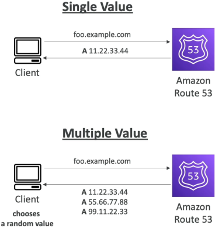
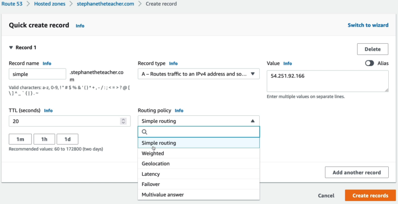

# Routing Policy: Simple

:::note
DNS routing is not physical packet routing, unlike ALB. Route 53 doesn't touch your application traffic, it just handles the client a map and says _"Here is where the site lives, bro. Go there and ask for it."_
:::

The **Simple Routing Policy** is the default, baseline routing behaviour in Amazon Route 53. It is engineered to map a domain name to a single static resource endpoint. While you cannot create multiple individual records with the exact same name and type using this policy, a single Simple record can hold a flat text list of **multiple hardcoded IP addresses**. When queries, Route 53 returns the entire list to the client in a randomized order, offloading the final connection choice completely to client-side logic.

## Key Takeaways

### The Multi-Value Resolution Mechanic

Stephane's demonstration with the two regional IPs (`ap-southeast-1` and `us-east-1`) reveals how Route 53 handles multi-valued Simple records under the hood:

1. Your application code or a user hits `simple.example.com`.
2. Route 53 opens the zone file, grabs **all** the listed IP strings inside that single record container, shuffles them randomly, and streams the entire array back to the client resolver in a single payload.
3. The client browser typically selects the very first IP in the returned list to execute its HTTP connection socket.
4. If you wait for the TTL to expire and run a clean `dig` command again, the order of the IPs rotates. This gives you a primitive, client-side round-robin method of load distribution.

---

:::warning
Simple routing is called simple because it has zero architectural awareness of your infrastructure's operational health.
If you hardcoded 3 separate EC2 public IP inside a single `A` record, ad two of instances suffers a failure, **Route 53 will still continue to server that dead IP ro 33% of your users**
:::

## Exam Tips

**The Static S3 Landing Page Match**: If an exam question says, _"You are deploying a basic corporate landing page consisting entirely of static HTML, CSS, and JS assets hosted out of a single public Amazon S3 Bucket configured as a static website. The application does not require any regional failover logic or latency balancing. Which routing policy should you select?"_ **The Definitive answer is Simple Routing**. Since you are pointing to a single, highly durable cloud native endpoint, you don't need complex weight profiles or network telemetry logic.
