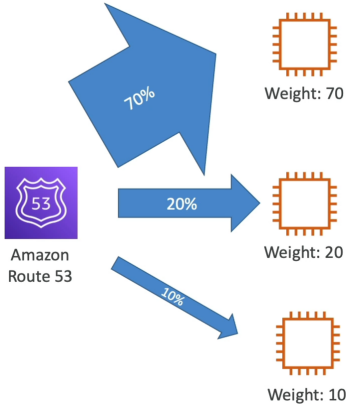
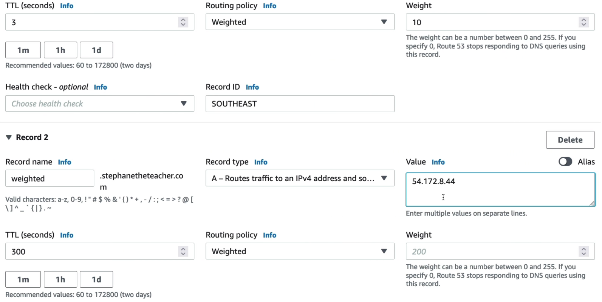

# Routing Policy: Weighted

Unlike the simple policythat just blindly shuffles a bunch of IPs, weighted routing lets you precisely dial in exactly what percentage of global DNS queries get answered with which specific infrastructure backend.

The **Weighted Routing Policy** allows the engineers to create multiple independent DNS records of the identical name and type, assigning each record a relative numerical weight (from 0 to 255). When a client queries Route 53, the service dynamically calculates a probability matrix on the fly. The chance of specific record being returned is its identical weight divided by the sum total of all active weights in that record set.

## Key Takeaways

### The Math

Let's say you configure three EC2 instances behind a single DNS name, each with the following weights:

- **AP-Southeast (Singapore)**: Weight 10
- **EU-Central (Frankfurt)**: Weight 20
- **US-East (Virginia)**: Weight 70
- **Total Weight**: 10 + 20 + 70 = 100

Traffic to US-East = 70/100 = 70%

:::info
The weights do **not** have to add up to 100. If you create two records and give one a weight of 1 and the other a weight of 1, the sum is 2. Each record will receive exactly 50% (1/2) of the traffic. Route 53 just evaluates the relative ratios between the numbers.
:::

### The Power of Weigh = 0

Setting a record's weight to exactly 0 triggers an explicit architectural guardrail:

- **The Traffic Kill-Switch**: Route 53 will completely stop returning that specific IP address or resourceendpoint to consumers. This is perfect for cleanly draining traffic off a legacy server pool during updates without deleting the underlying record configuration.
- **The "All Zero" Paradox"**: If you configure **every single record** in a weighted set to weight of 0, Route 53 drops the math entirely and treats them as equally weighted, returning them randomly with equal probability across the board.

### Prime Production Use Cases

- 🏎️ **Canary Deployment/Version Testing**: When launching a brand-new, unproven version of your app (Version 2), you don't want to risk crashing your whole user base. You deploy Version 2 on a fresh server tier, add it to your weighted record set, and give it a tiny weight of 5 while keeping Version 1 at a weight of 95. You monitor your error budgets, log streams, and performance metrics. If it holds up, you gradually scale the Version 2 weight up to 100 and drop Version 1 down to 0.
- ⚖️ **Cross-Region Load Balancing**: Coarsely dividing traffic loads between major geographic infrastructure clusters if you aren't using advanced automation proxies.

## Exam Tips

**The Hosted Zone Layout Distinctness**: Pay close attention to how this looks in the console versus as Simple record block. In a Simple record, you have _one single record line item_ that holds a big text array of multiple internal IPs. In a **Weighted Routing Policy, you must explicitly create multiple, completely separate record entries in your Hosted Zone list**. Each individual row has its own unique **Record ID** descriptor (like `US-East` or `EU-Central`), its own specific weight value, and maps to exactly one unique destination value.

