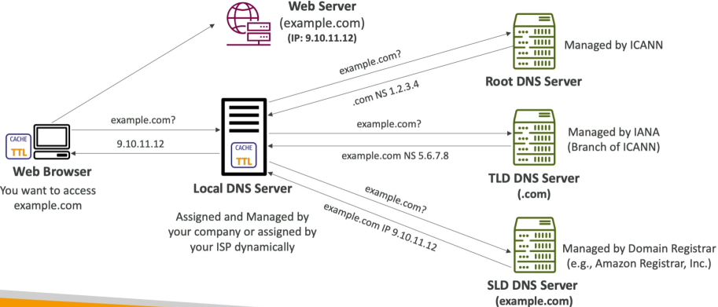

# What is a DNS?

The Domain Name System (DNS) is a hierarchical, globally distributed database infrastructure whose primary job is to translate human-readable hostname (like `www.google.com`) into computer-routable IP address (like `142.250.190.46`). It functions as the foundational routing matrix of the internet, allowing client web browsers to establish TCP/IP handshakes with remote application servers without users needing to memorize strings of numbers.

## Key Takeaways

### Anatomy of a URL & Naming Hierarchy

A **Fully Qualified Domain Name (FQDN)** follows a strict right-to-left resolution hierarchy, where each segment separated by a dot represents a deeper level of specific authority.

```
http://  api.  www.  example.  com.
 │        │     │       │       │   └── 1. The Root Zone (Implied trailing dot)
 │        │     │       │       └────── 2. Top-Level Domain (TLD)
 │        │     │       └────────────── 3. Second-Level Domain (SLD)
 │        │     └────────────────────── 4. Subdomain
 │        └──────────────────────────── 5. Third-Level Subdomain / Application Host
 └───────────────────────────────────── 6. Protocol Scheme
```

- **The Root Zone (.)**: The absolute top of the tree. While we don't type it into our browsers, every FQDN technically ends with an invisible trailing dot (e.g., example.com.). This represents the core structural index pointing to global infrastructure nodes.
- **Top-Level Domain (TLD)**: Managed by **IANA/ICANN**. These classify the extension type, splitting into **generic TLDs** (`.com`, `.org`, `.net`) and **country-code TLDs** (`.au`, `.my`, `.id`).
- **Second-Level Domain (SLD)**: This is the custom string you purchase frm a domain registrar (like `amazon` in `amazon.com`). It represents your unique namespace under the TLD.
- **Subdomain**: Optional prefixes utilized by infrastructure engineers to segregate application environments or traffic planes (e.g., `www`, `api`, `dev`).

### The 4 Distinct Server Archetypes

When a DNS query fires out, it passes through a sequence of four different server roles to track down the truth:

- **The Recursive Resolver**: The workhorse or "concierge librarian". Usually managed by your ISP or a public utility (like Cloudflare's `1.1.1.1` or Google's `8.8.8.8`). Your browser asks only this server for help, and the resolver goes out to do the heavy lifting of hunting down the records across the web on your behalf.
- **The Root Name Server**: The primary index. There are 13 logical root server addresses globally. They don't know your specific IP, but they know exactly where to find the managers of the requested TLS (e.g., "I don't know where `example.com` is, but here is the IP for the `.com` registry").
- **The TLD Name Server**: The extension manager. It looks at the second-level domain request and points the query toward the specific authoritative manager (e.g., "Go ask the Route 53 servers holding the zone files for `example.com`").
- **The Authoritative Name Server**: The final destination. This is where your custom **Zone File** lives (e.g., inside Route 53). It holds the master record list and provides the definitive IP address answer back to the resolver.

### The Live Recursive Resolution Lifecycle

When your browser want to fetch data from `example.com` for the first time, it kicks off a chain-reaction look-up sequence:


1. **The Client Request**: The browser checks local memory caches. If empty, it passes a recursive query down to the **Recursive Resolver**.
2. **The Root Iteration**: The resolver checks its own cache. If it's a miss, it pings the **Root Server**. The Root server reads the trailing `.com` extension and hands back the IP coordinates for `.com` TLD cluster.
3. **The TLD Iteration**: The resolver pivots and queries the `.com` **TLD Server**. The TLD server finds the registration entry for `example.com` and replies with the Authoritative Name Server IP (e.g., AWS Route 53 targets).
4. **The Authoritative Handshake**: The resolver targets the **Authoritative Name Server**. This server reads its local Zone File database, locates the matching **A Record**, and returns the exact hosting server IP address: `9.10.11.12`
5. **The Return & Cache**: The resolver forwards the IP address back to your browser while saving a local copy inside its cache for the duration of the record's Time-to-Live (TTL). Your browser can now open up a direct socket tunnel to the target web server's IP address!

## Exam Tips

**The TTL/Cache Performance Balancing Act**: The exam heavily test your understanding of **Time-to-Live (TTL)** settings on records. A high TTL (e.g., 86,400 seconds/24 hours) means recursive resolvers cache your IP all day, dramatically speeding up page loads and dropping your Route 53 query invoice costs to nearly zero. However, if you execute an emergency server migration or failover, users will pull your dead cached IP from their local resolvers until that 24-hour window ticks down to zero. For highly volatile or disaster-recovery stacks, keep your record TTLs low (e.g., 60 to 300 seconds).
